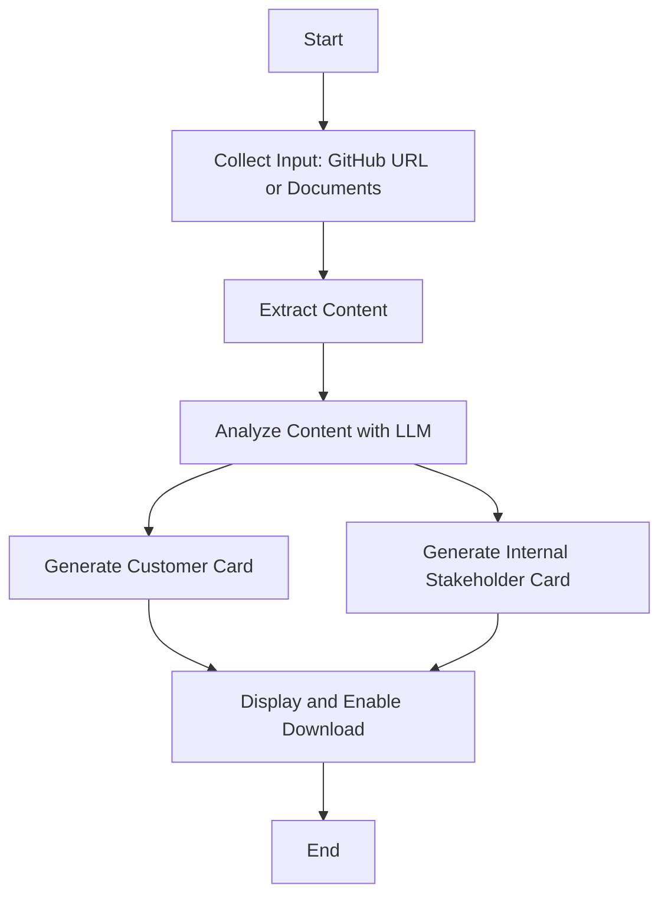

# AI Explainability Card Generator

## Description

The AI Explainability Card Generator is a tool designed to create comprehensive, easy-to-understand explanations of AI models and systems. In an era where AI is becoming increasingly prevalent and complex, there's a growing need for clear, accessible explanations of how these systems work, both for technical stakeholders and for end-users. This project aims to bridge that gap by automatically generating two types of explainability cards: one for customers and another for internal stakeholders.

By leveraging the power of large language models and document analysis, this tool can take in various sources of information about an AI system - be it GitHub repositories, technical documents, or other uploaded files - and distill that information into concise, tailored explanations. This not only saves time for AI developers and product managers but also ensures consistency and comprehensiveness in how AI systems are explained and documented.


You can watch a demo of this in action [here](https://share.cleanshot.com/RnPnsGR7).

You can give it a try for yourself [here](https://ai-explainability-cards.replit.app).

## How It Works

The AI Explainability Card Generator operates through a series of steps to process input data and generate explainability cards:

1. **Input Collection**: The system accepts input in two forms:
   - A GitHub repository URL
   - Uploaded document files (e.g., PDFs, DOCXs)

2. **Content Extraction**: 
   - For GitHub repos, it clones the repository and extracts relevant information from code and documentation.
   - For uploaded documents, it parses the content using appropriate libraries.

3. **Content Analysis**: The extracted content is analyzed using a large language model (LLM) to identify key aspects of the AI system, such as its purpose, functionality, data usage, and potential impacts.

4. **Card Generation**: Two types of cards are generated:
   - A Customer Explainability Card, focusing on high-level explanations and user-centric information.
   - An Internal Stakeholder Explainability Card, providing more technical details and implementation specifics.

5. **Output**: The generated cards are displayed in the web interface and can be downloaded as DOCX files.



## Features

- **Dual Card Generation**: Creates both customer-facing and internal stakeholder explainability cards.
- **Multiple Input Sources**: Accepts GitHub repositories and various document formats as input.
- **LLM-Powered Analysis**: Utilizes advanced language models to extract and synthesize relevant information.
- **User-Friendly Interface**: Built with Streamlit for an intuitive, easy-to-use web application.
- **Downloadable Outputs**: Generates downloadable DOCX files for easy sharing and integration into existing documentation.
- **Customizable Templates**: Uses predefined templates that can be easily modified or expanded.

## Files

- **app.py**: The main Streamlit application file that handles the user interface and orchestrates the card generation process.
- **main.py**: Contains core functionality for content loading, processing, and card generation.
- **run.py**: This manages the the running of application.
- **requirements.txt**: Lists all Python dependencies required to run the project.

## Setup

To set up the AI Explainability Card Generator:

1. Clone the repository:
   ```
   git clone https://github.com/brayden-s-haws/ai-explainability-card-generator.git
   cd ai-explainability-card-generator
   ```

2. Install the required packages:
   ```
   pip install -r requirements.txt
   ```

3. Set up environment variables:
   - Create a `.env` file in the root directory
   - Add your API keys:
     ```
     ANTHROPIC_API_KEY=your_anthropic_api_key_here
     GITHUB_ACCESS_TOKEN=your_github_access_token_here
     ```

4. Run the Streamlit app:
   ```
   streamlit run run.py
   ```

## Roadmap

- Implement support for more input types (e.g., Jupyter notebooks, API documentation)
- Add customizable templates for different industries or use cases
- Integrate with popular AI model repositories for easier access to model information
- Implement a feedback mechanism to continually improve the quality of generated explanations
- Add multi-language support for global accessibility

## License

This project is open source and available under the [MIT License](LICENSE).
